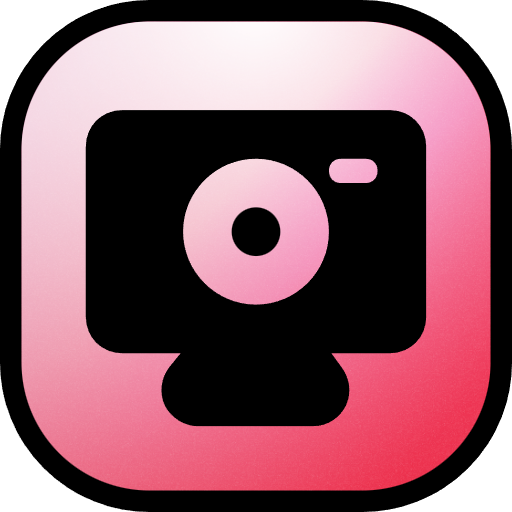

<p align="center">
  
</p>

<h1 align="center">Beam</h1>

<p align="center">
  
  
  
  
  
</p>

<p align="center">
  Beam is a fast, account-free WebRTC calling app with host controls, screen sharing, and a dark claymorphic interface.
</p>

## See what the App Looks Like

<div align="center">
  
  <br/><br/>
  
  <br/><br/>
  
</div>

## Features

- Create or join a six-character room in seconds with no account flow.
- Keep display names in `sessionStorage` for frictionless room entry.
- Establish direct peer-to-peer video and audio calls through WebRTC.
- Provide host controls for mute, remove, transfer host, and stopping screen share.
- Support single-presenter screen sharing with a yield-request flow.
- Handle full AV, audio-only, video-only, and no-media permission fallbacks.
- Include a responsive participant panel, creator attribution, and copy-link flow.

## Architecture

Beam runs entirely in the browser using a Next.js App Router frontend in `src/`. It relies on PeerJS to facilitate WebRTC peer discovery, data signaling, and media stream connections, entirely replacing the need for a custom signaling server.

The application uses the public PeerServer to exchange connection requests. Once peers discover each other, audio, video, and screen-share traffic flows directly between browsers over WebRTC.

## Getting Started

1. Clone the repository.
2. Install dependencies:

```bash
npm install
```

3. Run the app:

```bash
npm run dev
```

4. Open `http://localhost:3000`.

## Scripts

- `npm run dev` starts the Next.js app.
- `npm run build` creates a production build of the app.
- `npm run lint` runs ESLint across the project.
- `npm run test` runs the Vitest suite.

## Deployment

Deploy the frontend to any static or serverless host, such as Vercel. Since the app is completely peer-to-peer and relies on the default public PeerJS server, no additional backend services are required.

## Creator

Created by **Samin Yeasar**

- GitHub: [github.com/solez-ai](https://github.com/solez-ai)
- X: [x.com/Solez_None](https://x.com/Solez_None)
- Portfolio: [solez.vercel.app](https://solez.vercel.app)
- Project Repository: [github.com/Solez-ai/process-story](https://github.com/Solez-ai/process-story)

## License

Beam is licensed under the [MIT License](./LICENSE).
